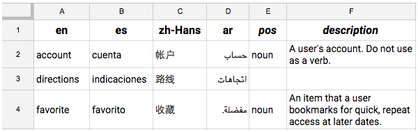

# 计算机术语库

Microsoft 术语集 https://www.microsoft.com/zh-cn/language/Terminology。

下载中文（中华人民共和国）版本，则术语库文件中包含同一术语的英文和中文。

转换为 csv 格式。

## 表头格式

| en  | zh_CN | pos | description |
| :-: | :---: | :-: | :---------: |
| ... |  ...  | ... |     ...     |

## 感谢 & 参考

https://github.com/chih7/CSTerminology

## 参考资料

Google Translator Toolkit 使用术语库
https://support.google.com/translatortoolkit/answer/6306379?hl=zh-Hans
